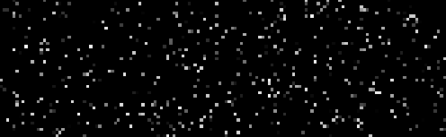

## Overview

This folder will create and train Sequential2D models on the CIFAR10 dataset with varying architectures defined by different weight sparsities in each block.  The result will be a dataset of model architectures and their corresponding train and test loss after N epochs.

From there we can train a **mother** model to predict a models loss based on its architecture *without* training it.

It is then possible to perform gradient descent on the *input* to generate a model architecture that the mother predicts will have a low loss, which we can then check by actually training it.


## Model Parameters and Training
Each Sequential2D model has three sections of blocks reserved the input, hidden features, and outputs.
```python
input_sizes = [75] * 100
hidden_sizes = [50] * 44
output_sizes = [10]
```

Are run for a fixed number of iterations.
```python
num_iterations = 4
```

And are trained for a fixed number of epochs before recording their loss
```python
num_epochs = 1
```

## Random Model Architectures
There are two ways we generate random model architectures to train and add to the dataset. The first has a random percent of the blocks sparsities be set to a random sparsity between 0-1, and the rest set to 0. An example of this can be seen below.



The second uses perlin noise normalized between 0-1, then setting all blocks with a sparsity < 0.5 to 0.


## Resulting dataset

